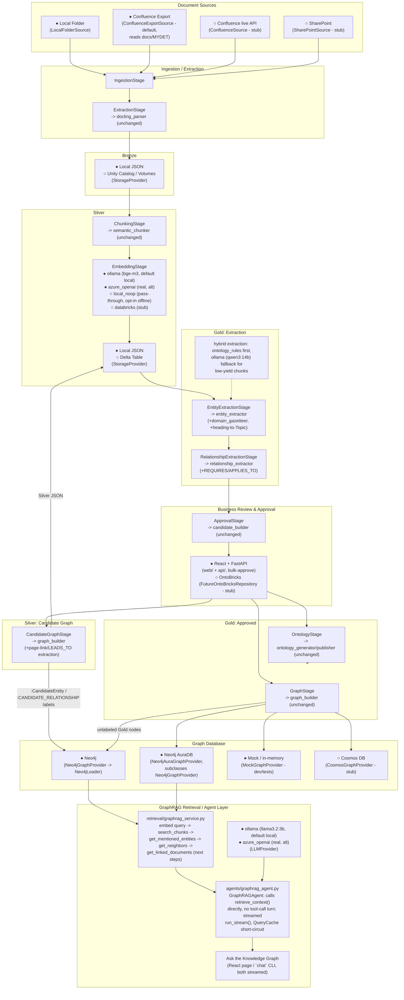

# Target Architecture

Each box below is annotated with whether an implementation is real/working
today (●) or is still a documented `NotImplementedError` stub (○). Multiple
● boxes in the same seam (e.g. Ollama and Azure OpenAI for embeddings) are
both real, working alternatives selected by `config.yaml`'s `provider:`
field (or the `ai.mode` shortcut) - not a "real vs. stub" pair. Switching
between them, or from ● to ○, is a `config.yaml` change plus (for ○)
implementing that one stub class - no other box changes.

## Reading the diagram

- **Solid business-logic boxes** (`docling_parser`, `semantic_chunker`,
  `entity_extractor`, `relationship_extractor`, `candidate_builder`,
  `ontology_generator`/`publisher`, `graph_builder`, `neo4j_loader`) appear
  unchanged/additive inside their stage - they have no inbound edge from
  `config.yaml` or `os.environ`. See [dependency_diagram.md](dependency_diagram.md)
  for the explicit proof of that. `entity_extractor`/`relationship_extractor`
  gained the `domain_gazetteer`, heading-to-`Topic` promotion, and
  `REQUIRES`/`APPLIES_TO` logic as additive business logic, still driven
  entirely by `ontology.yaml` content, not by config/env branches.
  `graph_builder`/`neo4j_loader` gained page-link (`LEADS_TO`) extraction
  and `get_linked_documents()` the same way.
- **Every other box** is a provider interface, selected by `config.yaml`'s
  `provider:` fields (or the `ai.mode: local`/`azure` shortcut for
  embedding/extraction/llm). `EmbeddingStage`, `ExtractionStage`'s hybrid
  path, and the retrieval layer's `LLMProvider` each have two real (●)
  implementations today (Ollama and Azure OpenAI), not one real and one
  stub - `local_noop`/`ontology_rules`-only extraction remain available as
  an explicit opt-in for fully offline runs.
- **Candidate Graph reaches Neo4j too**, but under `:CandidateEntity`/
  `:CANDIDATE_RELATIONSHIP` labels that the retrieval layer and Production
  Graph page never query - see [graph_governance.md](graph_governance.md)
  for exactly how that exclusion is enforced.
- **The retrieval/agent layer** (bottom subgraph) only reads from
  `GraphDB`'s unlabeled Gold nodes; it has no path back to `Review` or
  `CandGraph`.
