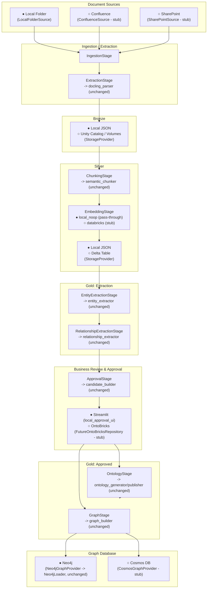

# Target Architecture

Each box below is annotated with whether its local implementation is
working today (●) or its Databricks/cloud implementation is a documented
stub (○). Switching from ● to ○ for a given seam is a `config.yaml` change
plus implementing that one stub class - no other box changes.

## Reading the diagram

- **Solid business-logic boxes** (`docling_parser`, `semantic_chunker`,
  `entity_extractor`, `relationship_extractor`, `candidate_builder`,
  `ontology_generator`/`publisher`, `graph_builder`, `neo4j_loader`) appear
  unchanged inside their stage - they have no inbound edge from `config.yaml`
  or `os.environ`. See [dependency_diagram.md](dependency_diagram.md) for
  the explicit proof of that.
- **Every other box** is a provider interface with exactly one local (●)
  implementation and one or more Databricks/cloud (○) stubs, selected by
  `config.yaml`'s `provider:` fields.
