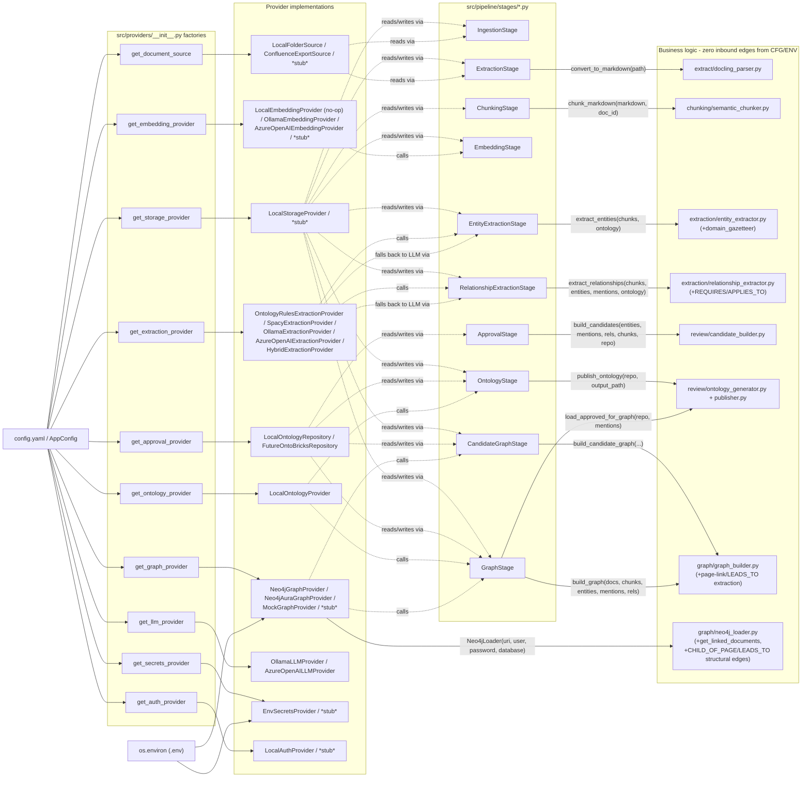

# Dependency Diagram: Stage → Provider → Business Logic

This diagram exists to make one property visually checkable: **business
logic has zero inbound edges from config or environment.** Every arrow
into a business-logic module comes from a Stage passing it plain dicts/
dataclasses; every arrow into `config.yaml`/`os.environ` terminates at a
provider factory or a provider constructor, never at a business-logic
module directly.

## What to check when reviewing this diagram

- No arrow goes from `CFG`/`ENV` directly into the `BusinessLogic` subgraph -
  every path into it passes through a Stage, which only ever hands the
  business-logic function plain data (dicts, lists, an `OntologyRepository`
  instance) - never a `Path`, an env var, or a config value. This still
  holds for the MYDET-domain-fit additions: `entity_extractor.py`'s
  `domain_gazetteer` lookups and `relationship_extractor.py`'s
  `REQUIRES`/`APPLIES_TO` trigger matching are driven entirely by
  `ontology.yaml` content passed in as a plain
  dict by the Stage - no new config/env edge was added.
- `HybridExtractionProvider` (`P7`) composes two other providers (a
  rules-first leg, an LLM provider as fallback for low-yield chunks) but is
  itself still just a provider selected by `extraction.provider: hybrid` -
  `S5`/`S6` call it exactly like any other `ExtractionProvider`, with no
  extra inbound config edge. The rules-first leg is itself config-selected
  via `extraction.options.hybrid.rules_backend: ontology_rules |
  spacy_rules` (`_build_rules_provider()`), defaulting to
  `OntologyRulesExtractionProvider` - this is one more config-driven branch
  inside `P7`, not a new inbound edge from `CFG` to a new box.
- `graph_builder.py`'s page-link (`LEADS_TO`) extraction reads only the
  `documents` list already passed into `build_graph()`/
  `build_candidate_graph()` by `S9`/`SCG` - no new inbound edge from
  `CFG`/`ENV` either.
- `Neo4jGraphProvider`/`Neo4jAuraGraphProvider` are the providers that read
  `ENV` directly (they always did, via `Neo4jLoader`) - they also read
  `CFG` for *which* env var names to use, but the values themselves still
  flow through `os.environ`, same as before. `Neo4jAuraGraphProvider`
  subclasses `Neo4jGraphProvider` and reuses the same env-var-name
  indirection.
- `CandidateGraphStage` (`SCG`) is a second consumer of `P6`
  (`get_graph_provider`), alongside `GraphStage` (`S9`) - it loads the
  Candidate Graph into the same graph database under distinct
  `:CandidateEntity`/`:CANDIDATE_RELATIONSHIP` labels. See
  [graph_governance.md](graph_governance.md) for why that doesn't
  compromise retrieval blindness.
