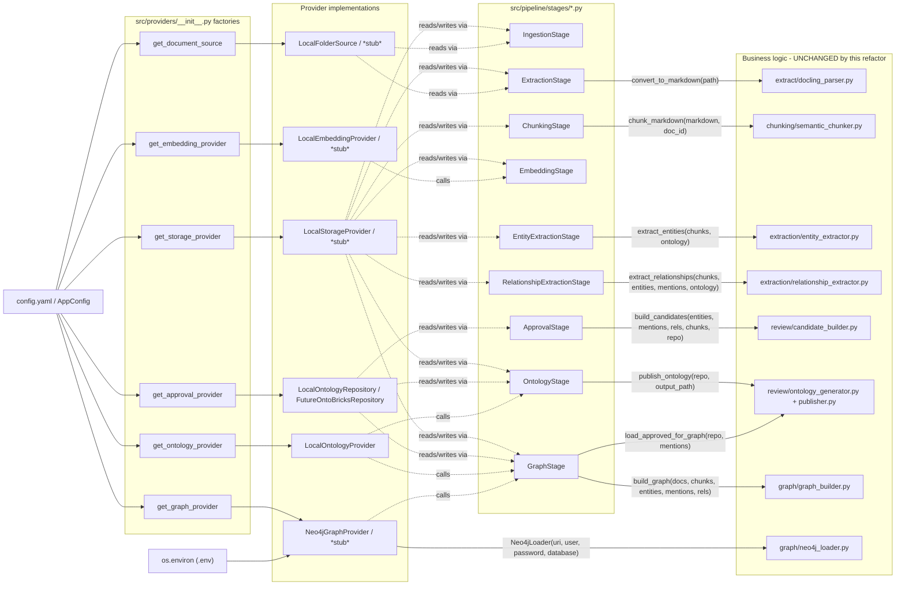

# Dependency Diagram: Stage → Provider → Business Logic

This diagram exists to make one property visually checkable: **business
logic has zero inbound edges from config or environment.** Every arrow
into a business-logic module comes from a Stage passing it plain dicts/
dataclasses; every arrow into `config.yaml`/`os.environ` terminates at a
provider factory or a provider constructor, never at a business-logic
module directly.

## What to check when reviewing this diagram

- No arrow goes from `CFG`/`ENV` directly into the `BusinessLogic` subgraph -
  every path into it passes through a Stage, which only ever hands the
  business-logic function plain data (dicts, lists, an `OntologyRepository`
  instance) - never a `Path`, an env var, or a config value.
- `Neo4jGraphProvider` is the one provider that reads `ENV` directly (it
  always did, via `Neo4jLoader`) - it now also reads `CFG` for *which* env
  var names to use, but the values themselves still flow through
  `os.environ`, same as before.
