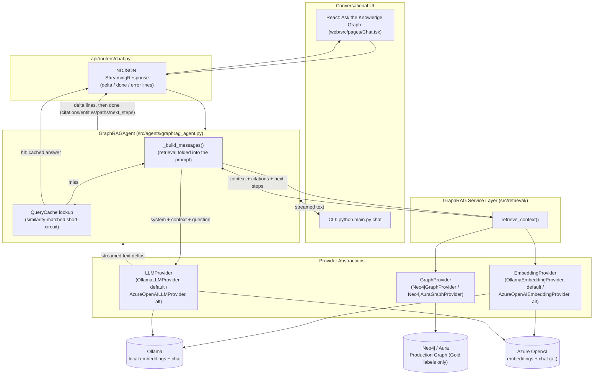
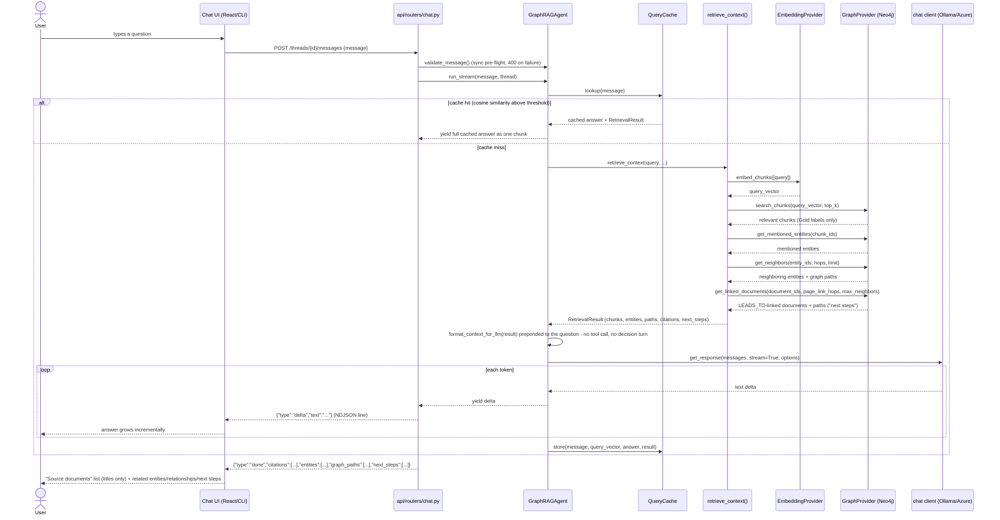

# GraphRAG Retrieval + Conversational AI Layer

## In plain terms

Once a graph has been published, someone can ask it a question in plain
English instead of writing a database query. Behind the scenes:

1. The question is turned into a vector (a kind of numeric fingerprint) and
   matched against the same fingerprints stored for every chunk of every
   document, to find the passages most likely to be relevant.
2. From those passages, the system follows the graph outward — to the things
   they mention, and to things related to those — building up a small,
   relevant slice of the knowledge graph.
3. It also checks whether the source documents point onward to other pages
   (a "see also" style link), so it can suggest sensible next steps.
4. All of that — the passages, the related things, and the next steps — is
   handed to the AI model along with the question, and the model writes an
   answer grounded only in that material. It's told plainly to say "I don't
   have enough approved information" rather than guess if nothing relevant
   was found.
5. The answer streams onto the screen as it's written, and always closes
   with a list of the source documents it drew from — never internal IDs,
   database terms, or anything a non-technical reader wouldn't recognize.

A repeated or closely-rephrased question skips all of that and returns the
previous answer instantly, since re-computing the same answer would be
wasteful.

This whole layer is additive: nothing about how documents get extracted,
chunked, reviewed, or approved changed to add it.

```
Docling extraction -> Chunking -> Embeddings -> Entity/Relationship
extraction -> Approval -> Ontology -> Production Graph -> Neo4j
                                                              |
                                                              v
                              GraphRAG Retrieval Layer (new) -> Conversational
                              Layer (new, agent_framework chat client, direct
                              retrieval - no tool-call turn) -> "Ask the
                              Knowledge Graph" (React page + CLI, streamed)
```

The rest of this document is a technical reference for engineers working on
this layer — architecture diagrams, sequence diagrams, config keys, and
implementation history.

## Summary

## New abstractions (same factory convention as every existing provider)

| Capability | ABC | Implementation | Factory |
|---|---|---|---|
| Real embeddings | `EmbeddingProvider` (existing) | `OllamaEmbeddingProvider` (default local, `bge-m3`) / `AzureOpenAIEmbeddingProvider` (alt) | `get_embedding_provider()`, `embedding.provider: ollama \| azure_openai` (or `ai.mode: local \| azure`) |
| Chat completion | `LLMProvider` | `OllamaLLMProvider` (default local, `llama3.2:3b`) / `AzureOpenAILLMProvider` (alt) | `get_llm_provider()`, `llm.provider: ollama \| azure_openai` |
| Graph reads for retrieval | `GraphProvider` (14 methods total, including `search_chunks`/`get_mentioned_entities`/`get_neighbors`/`get_linked_documents`) | `Neo4jGraphProvider` / `Neo4jAuraGraphProvider` (subclasses it) / `MockGraphProvider` / `CosmosGraphProvider` (stub) | `get_graph_provider()` (unchanged) |

`LLMProvider.get_chat_client()` returns a Microsoft Agent Framework
`ChatClientProtocol` implementation, not raw text. Unlike an
`agent_framework.ChatAgent`, `GraphRAGAgent` (`src/agents/graphrag_agent.py`)
never hands the client a tool to decide whether to call - retrieval always
runs first, in plain Python, and its output is folded straight into the
prompt before the single chat-completion call. See "Conversational layer"
below for why. Ollama and Azure OpenAI are both real, working
implementations selected the same way every other provider is - `ai.mode:
local` (the current `config.yaml` default) resolves both
`embedding.provider` and `llm.provider` to `ollama` unless a section
explicitly overrides it; `ai.mode: azure` resolves both to `azure_openai`.

Azure secrets (`AZURE_OPENAI_ENDPOINT`, `AZURE_OPENAI_API_KEY`) are resolved
via the existing `SecretsProvider` abstraction, the same indirection
`Neo4jGraphProvider` already uses - never hardcoded in `config.yaml`. Ollama
needs no secrets at all - `base_url`/`model` are plain `config.yaml` values
(`embedding.ollama`, `llm.ollama`), alongside `num_thread`, `temperature`,
and `seed` (see "Determinism and CPU tuning" below).

## Architecture diagram



## Sequence diagram (one turn)



## Retrieval pipeline (`src/retrieval/graphrag_service.py`)

`retrieve_context(query, embedding_provider, graph_provider, config)`:

1. Embed the query via `EmbeddingProvider.embed_chunks()` (reusing the exact
   same abstraction/model the ingest pipeline uses for chunks).
2. `GraphProvider.search_chunks()` - Neo4j native vector index lookup
   (`CALL db.index.vector.queryNodes('chunk_embedding', ...)`).
3. `GraphProvider.get_mentioned_entities()` - walks the existing
   `(Chunk)-[:MENTIONS]->(Entity)` relationship (already present, no schema
   change - see `Neo4jLoader.load_mentions()`).
4. `GraphProvider.get_neighbors()` - graph expansion to neighboring entities
   within `retrieval.graph_expansion_hops` hops, capped at
   `retrieval.max_neighbors`.
5. `GraphProvider.get_linked_documents()` - follows outgoing `LEADS_TO`
   page-link relationships from the cited documents, up to
   `retrieval.page_link_hops` hops (default 2), to surface a "next steps in
   this process" pointer (e.g. "Escalation Process leads to Fraud Referral
   Form").
6. Assembles a `RetrievalResult` (chunks, entities, human-readable graph
   paths, citations, `next_steps`) and renders it as plain text for the LLM
   (`format_context_for_llm()` - never emits "node"/"edge"/"cypher"; emits a
   "Next steps in this process:" section only when `next_steps` is
   non-empty).

`GraphRAGAgent._build_messages()` (`src/agents/graphrag_agent.py`) calls
`retrieve_context()` directly and folds `format_context_for_llm()`'s output
straight into the prompt as a `system` instruction message plus a `user`
message of `"{context_block}\n\nQuestion: {message}"` - there is no
intervening tool call, and thus no separate LLM turn spent deciding whether
to retrieve. Retrieval is unconditional: it always runs (unless the
`QueryCache` already has a close-enough match for this question - see
"Query cache" below), and always precedes the single chat-completion call.

## Query cache (`src/retrieval/query_cache.py`)

`QueryCache` holds a bounded, in-memory, FIFO-evicted list of past
`(query, answer, RetrievalResult)` triples (size capped by
`retrieval.query_cache_max_entries`, default 200; not persisted across
restarts). `lookup(query)` first tries an exact normalized-text match, then
falls back to embedding the query and comparing cosine similarity against
every cached entry's embedding, returning the best match if it's above
`retrieval.query_cache_similarity_threshold` (default `0.96`). On a hit,
`GraphRAGAgent.run()`/`run_stream()` skip retrieval and the LLM call
entirely - `run()` returns the cached answer directly, `run_stream()` yields
it as a single chunk. This is enabled by default
(`retrieval.query_cache_enabled: true`) and exists mainly to make
repeated/rephrased demo and QA questions return instantly instead of
re-paying a full CPU-bound generation.

## Determinism and CPU tuning (`config.yaml`'s `llm.ollama`)

- `model: llama3.2:3b` - swapped from the original `llama3.1:8b` for ~2.2x
  faster generation on this CPU-only machine, at comparable grounded-answer
  quality (benchmarked against real retrieved context before switching).
- `num_thread: 12` - pins Ollama's generation to all physical cores on this
  dev machine; Ollama's own default heuristic under-uses them.
- `temperature: 0.1` and `seed: 42` - low-but-nonzero temperature (avoids
  the repetition/looping some models fall into at exactly 0) plus a fixed
  seed, so the same question against the same graph state and the same
  retrieved context reproduces the same answer - verified by running the
  same question twice against the live agent and diffing the two answers
  byte-for-byte. `OllamaLLMProvider.get_chat_options()` passes all three
  through as Ollama chat options; `AzureOpenAILLMProvider` does not use
  them.

## Gating invariant (extends the Silver/Gold separation)

**Only the Gold Production Graph is ever used to answer a question. The
Candidate Graph is never queried by anything in `src/retrieval/` or
`src/agents/`.** This is enforced by label exclusion, not by the Candidate
Graph being unable to reach Neo4j - `CandidateGraphStage` does load it into
the same graph database (see `docs/architecture/graph_governance.md`):

- `GraphProvider.build_production_graph()` is the only code path that
  writes unlabeled (Gold) `:Entity`/relationship nodes, fed exclusively by
  `ontology_generator.load_approved_for_graph()` (approved-only).
  `CandidateGraphStage` writes the Candidate set separately, under
  `:CandidateEntity`/`:CANDIDATE_RELATIONSHIP` labels, via
  `GraphProvider.build_candidate_graph()`.
- `search_chunks`, `get_mentioned_entities`, `get_neighbors`, and
  `get_linked_documents` all live on the same `GraphProvider`/
  `Neo4jGraphProvider`, and every one of them is implemented to match only
  the unlabeled Gold nodes/relationships - none of them match
  `:CandidateEntity`/`:CANDIDATE_RELATIONSHIP`. There is nothing in
  `src/retrieval/graphrag_service.py` that references `ApprovalProvider`'s
  candidate-side methods, `StorageProvider.read_candidate_graph()`, or the
  Candidate labels at all.
- If the Production Graph has never been published (no approved entities
  yet), retrieval simply returns no chunks, and the agent is instructed to
  say it lacks enough approved information rather than guess - even if the
  Candidate Graph already has plenty of unapproved content sitting in the
  same database.

## Chunk embeddings on the graph (Requirement: reuse embeddings, vector index)

`EmbeddingStage` writes `DocumentEmbeddingRecord`s to
`silver/embeddings/embeddings.json`, keyed by `chunk_id` - separate from
`silver/chunks/chunks.json`. `GraphStage` joins the two by `chunk_id`
before calling `graph_builder.build_graph()`, so `Chunk` nodes carry an
`embedding` property. `Neo4jLoader.load_graph()` creates the vector index
(`CREATE VECTOR INDEX chunk_embedding IF NOT EXISTS ... cosine similarity`)
once real embeddings are present - idempotent, safe to call on every
`publish-graph` run. With the default `ollama`/`azure_openai` embedding
providers, real vectors are present on every run; it's only a no-op when
`embedding.provider: local_noop` is explicitly selected for an offline dry
run (chunks simply have no `embedding` property).

## Answer format and citations

`src/prompts/graphrag_answer.py`'s `INSTRUCTIONS` (the `system` message
`_build_messages()` sends) explicitly tell the model: the reader is
non-technical, so write the main answer as plain narrative prose; never
mention chunk numbers, document IDs, or any other internal identifier in
it; refer to source material only by document title, and only where it
reads naturally; and close with a final `References:` line listing the
distinct document titles the answer drew on. `RetrievalResult.citations`
(and the API's `done` event) still carry the full
`{chunk_id, document_id, document_name}` triple for every cited chunk, but
`web/src/pages/Chat.tsx`'s "Source documents" section only ever renders the
de-duplicated `document_name` values - chunk/document IDs never reach the
end user, in the answer text or in the UI. Related entities, relationship
paths, and next steps render in their own sections of the same expander,
phrased as entity-relationship sentences (e.g. "Billing Service USES
Payment Gateway") - never "Node", "Edge", "Cypher", or "Ontology Class".

## Implementation plan (as executed)

1. `AzureOpenAIEmbeddingProvider` (`src/providers/azure_openai_embedding_provider.py`)
   + `azure_openai` branch in `get_embedding_provider()`.
2. `LLMProvider` ABC (`src/providers/llm_provider.py`) +
   `AzureOpenAIChatLLMProvider` + `get_llm_provider()` factory.
3. `GraphProvider` ABC gains `search_chunks`/`get_mentioned_entities`/
   `get_neighbors`; implemented in `Neo4jGraphProvider`; stubbed with
   `NotImplementedError` in `CosmosGraphProvider` to stay instantiable.
4. `Neo4jLoader` gains `create_vector_index`, an `embedding` passthrough in
   `load_chunks`, and the three query methods.
5. `GraphStage` joins `storage.read_embeddings()` onto chunks by `chunk_id`
   before `graph_builder.build_graph()`; `build_graph()` gains an additive
   `embedding` field on chunk nodes.
6. `src/retrieval/graphrag_service.py` - `retrieve_context()` +
   `RetrievalResult` + `format_context_for_llm()`.
7. `src/agents/graphrag_agent.py` - originally a `GraphRAGAgent` wrapping an
   `agent_framework.ChatAgent` with a single `graph_context_tool` (see
   "Since implemented" below for why this was later removed).
8. `LLMConfig`/`RetrievalConfig` added to `AppConfig`; `llm:`/`retrieval:`
   sections added to `config.yaml`.
9. `chat` subcommand added to `src/main.py` (terminal REPL).
10. Conversational UI (with citations), originally a Streamlit page -
    see "Since implemented" below for the migration to React.
11. This document.
12. `README.md` updated with the extended flow, new page, new CLI command,
    and new `.env` variables.
13. `requirements.txt` gains `agent-framework`, `agent-framework-azure-ai`.
14. `tests/test_graphrag_service.py` + provider-factory tests.
15. Full test suite re-run to confirm no regressions.

## Since implemented (additive updates)

The steps above are a historical record of this feature's original build,
which was Azure-only and Streamlit-based at the time. Since then, several
rounds of additive/replacement changes moved the layer to its current
state:

- `OllamaEmbeddingProvider`/`OllamaLLMProvider` were added alongside the
  Azure implementations, and `ai.mode: local` (now `config.yaml`'s default)
  resolves `embedding.provider`/`llm.provider` to `ollama` - see the
  updated "New abstractions" table above.
- `GraphProvider.get_linked_documents()` was added (alongside
  `build_candidate_graph()`/`build_production_graph()` for the Silver/Gold
  split - see `graph_governance.md`), and `retrieve_context()` now calls it
  to populate `RetrievalResult.next_steps` from `LEADS_TO` page-links.
- `Neo4jAuraGraphProvider` and `MockGraphProvider` were added as further
  `GraphProvider` implementations; all retrieval methods are inherited/
  reimplemented consistently across them.
- **The Streamlit UI (`app/`) was fully removed and replaced by the React
  app (`web/`) + FastAPI backend (`api/`)** that the rest of this codebase's
  review workflow already used - "Ask the Knowledge Graph" is now
  `web/src/pages/Chat.tsx`, served the same way as every other page,
  instead of a separate Streamlit process. `app/common.py`,
  `app/pages/chat.py`, and `app/streamlit_app.py` no longer exist.
- **The `agent_framework.ChatAgent` + `graph_context_tool` pattern was
  removed** in favor of calling `retrieve_context()` directly from
  `GraphRAGAgent._build_messages()` (see the module docstring in
  `src/agents/graphrag_agent.py`). On CPU-only inference, letting the model
  decide whether to call a tool cost a full extra generation pass before
  the one that writes the answer; retrieval is unconditional instead, at no
  change to what the model ultimately sees.
- **Chat responses now stream** - `GraphRAGAgent.run_stream()` yields text
  deltas from the chat client as they're generated; `api/routers/chat.py`
  relays them as NDJSON `delta` lines, followed by one `done` line carrying
  citations/entities/graph_paths/next_steps once the stream ends; the React
  page and the CLI REPL both render tokens incrementally instead of
  blocking until the full answer is ready.
- **A `QueryCache` was added** (`src/retrieval/query_cache.py`) to short-
  circuit repeated/near-duplicate questions - see "Query cache" above.
- **The default model, thread count, temperature, and seed were tuned** for
  CPU-only latency and determinism - see "Determinism and CPU tuning" above.
- **The answer format changed**: the LLM's main answer is now plain
  narrative prose with no chunk/document IDs, closing with a `References:`
  line of document titles only - see "Answer format and citations" above.

## Verification

1. `pytest tests/` - existing suite stays green, plus new retrieval tests.
2. With Ollama running locally (default `ai.mode: local`) or real
   `AZURE_OPENAI_*` secrets (`ai.mode: azure`), and Neo4j running: `ingest`
   (real embeddings), `publish-graph` (vector index + chunk vectors
   loaded), then `python src/main.py chat` - ask a question, confirm the
   answer streams token-by-token and ends with a grounded, non-technical
   answer plus a `References:` line naming real document titles.
3. `npm run dev` in `web/` -> "Ask the Knowledge Graph" - same question,
   confirm the answer renders incrementally, the "Source documents"
   section lists document titles only (no chunk/document IDs), and no
   "Node"/"Edge"/"Cypher"/"Ontology Class" text appears anywhere on the
   page.
4. Ask a question with no relevant approved content - confirm the agent
   says it lacks enough approved information, and confirm only
   `GraphProvider` methods were ever called (no `ApprovalProvider`/
   `StorageProvider` candidate-side reads) in `src/retrieval/`.
5. Ask the same question twice - confirm the second answer returns
   effectively instantly as a single chunk (query-cache hit) rather than
   re-running retrieval and generation.
6. Ask the same question twice with `temperature`/`seed` set as configured
   in `config.yaml` and the query cache disabled - confirm the two answers
   are byte-for-byte identical (determinism), not just similar.
