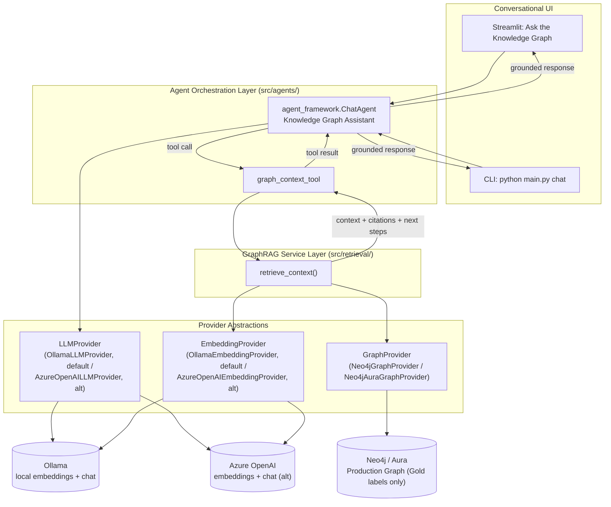
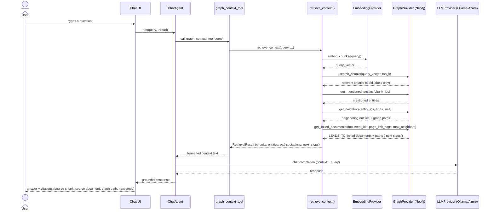

# GraphRAG Retrieval + Conversational AI Layer

## Summary

The pipeline previously stopped at "approved graph published to Neo4j" -
there was no way to ask it a question. This extends the existing six-provider
architecture (`DocumentSource`, `StorageProvider`, `ApprovalProvider`,
`OntologyProvider`, `GraphProvider`, `EmbeddingProvider`, plus
`SecretsProvider`/`AuthProvider`) with a Retrieval Layer and a Conversational
AI Layer. Nothing about extraction, chunking, entity/relationship extraction,
approval, ontology generation, or Neo4j publishing changed - this is purely
additive:

```
Docling extraction -> Chunking -> Embeddings -> Entity/Relationship
extraction -> Approval -> Ontology -> Production Graph -> Neo4j
                                                              |
                                                              v
                              GraphRAG Retrieval Layer (new) -> Conversational
                              Agent (new, Microsoft Agent Framework) ->
                              "Ask the Knowledge Graph" (Streamlit, new)
```

## New abstractions (same factory convention as every existing provider)

| Capability | ABC | Implementation | Factory |
|---|---|---|---|
| Real embeddings | `EmbeddingProvider` (existing) | `OllamaEmbeddingProvider` (default local, `bge-m3`) / `AzureOpenAIEmbeddingProvider` (alt) | `get_embedding_provider()`, `embedding.provider: ollama \| azure_openai` (or `ai.mode: local \| azure`) |
| Chat completion | `LLMProvider` | `OllamaLLMProvider` (default local, `llama3.1:8b`) / `AzureOpenAILLMProvider` (alt) | `get_llm_provider()`, `llm.provider: ollama \| azure_openai` |
| Graph reads for retrieval | `GraphProvider` (14 methods total, including `search_chunks`/`get_mentioned_entities`/`get_neighbors`/`get_linked_documents`) | `Neo4jGraphProvider` / `Neo4jAuraGraphProvider` (subclasses it) / `MockGraphProvider` / `CosmosGraphProvider` (stub) | `get_graph_provider()` (unchanged) |

`LLMProvider.get_chat_client()` returns a Microsoft Agent Framework
`ChatClientProtocol` implementation, not raw text - the agent layer owns the
completion loop, not the provider. Ollama and Azure OpenAI are both real,
working implementations selected the same way every other provider is -
`ai.mode: local` (the current `config.yaml` default) resolves both
`embedding.provider` and `llm.provider` to `ollama` unless a section
explicitly overrides it; `ai.mode: azure` resolves both to `azure_openai`.

Azure secrets (`AZURE_OPENAI_ENDPOINT`, `AZURE_OPENAI_API_KEY`) are resolved
via the existing `SecretsProvider` abstraction, the same indirection
`Neo4jGraphProvider` already uses - never hardcoded in `config.yaml`. Ollama
needs no secrets at all - `base_url`/`model` are plain `config.yaml` values
(`embedding.ollama`, `llm.ollama`).

## Architecture diagram



## Sequence diagram (one turn)



## Retrieval pipeline (`src/retrieval/graphrag_service.py`)

`retrieve_context(query, embedding_provider, graph_provider, config)`:

1. Embed the query via `EmbeddingProvider.embed_chunks()` (reusing the exact
   same abstraction/model the ingest pipeline uses for chunks).
2. `GraphProvider.search_chunks()` - Neo4j native vector index lookup
   (`CALL db.index.vector.queryNodes('chunk_embedding', ...)`).
3. `GraphProvider.get_mentioned_entities()` - walks the existing
   `(Chunk)-[:MENTIONS]->(Entity)` relationship (already present, no schema
   change - see `Neo4jLoader.load_mentions()`).
4. `GraphProvider.get_neighbors()` - graph expansion to neighboring entities
   within `retrieval.graph_expansion_hops` hops, capped at
   `retrieval.max_neighbors`.
5. `GraphProvider.get_linked_documents()` - follows outgoing `LEADS_TO`
   page-link relationships from the cited documents, up to
   `retrieval.page_link_hops` hops (default 2), to surface a "next steps in
   this process" pointer (e.g. "Escalation Process leads to Fraud Referral
   Form").
6. Assembles a `RetrievalResult` (chunks, entities, human-readable graph
   paths, citations, `next_steps`) and renders it as plain text for the LLM
   (`format_context_for_llm()` - never emits "node"/"edge"/"cypher"; emits a
   "Next steps in this process:" section only when `next_steps` is
   non-empty).

## Gating invariant (extends the Silver/Gold separation)

**Only the Gold Production Graph is ever used to answer a question. The
Candidate Graph is never queried by anything in `src/retrieval/` or
`src/agents/`.** This is enforced by label exclusion, not by the Candidate
Graph being unable to reach Neo4j - `CandidateGraphStage` does load it into
the same graph database (see `docs/architecture/graph_governance.md`):

- `GraphProvider.build_production_graph()` is the only code path that
  writes unlabeled (Gold) `:Entity`/relationship nodes, fed exclusively by
  `ontology_generator.load_approved_for_graph()` (approved-only).
  `CandidateGraphStage` writes the Candidate set separately, under
  `:CandidateEntity`/`:CANDIDATE_RELATIONSHIP` labels, via
  `GraphProvider.build_candidate_graph()`.
- `search_chunks`, `get_mentioned_entities`, `get_neighbors`, and
  `get_linked_documents` all live on the same `GraphProvider`/
  `Neo4jGraphProvider`, and every one of them is implemented to match only
  the unlabeled Gold nodes/relationships - none of them match
  `:CandidateEntity`/`:CANDIDATE_RELATIONSHIP`. There is nothing in
  `src/retrieval/graphrag_service.py` that references `ApprovalProvider`'s
  candidate-side methods, `StorageProvider.read_candidate_graph()`, or the
  Candidate labels at all.
- If the Production Graph has never been published (no approved entities
  yet), retrieval simply returns no chunks, and the agent is instructed to
  say it lacks enough approved information rather than guess - even if the
  Candidate Graph already has plenty of unapproved content sitting in the
  same database.

## Chunk embeddings on the graph (Requirement: reuse embeddings, vector index)

`EmbeddingStage` writes `DocumentEmbeddingRecord`s to
`silver/embeddings/embeddings.json`, keyed by `chunk_id` - separate from
`silver/chunks/chunks.json`. `GraphStage` joins the two by `chunk_id`
before calling `graph_builder.build_graph()`, so `Chunk` nodes carry an
`embedding` property. `Neo4jLoader.load_graph()` creates the vector index
(`CREATE VECTOR INDEX chunk_embedding IF NOT EXISTS ... cosine similarity`)
once real embeddings are present - idempotent, safe to call on every
`publish-graph` run. With the default `ollama`/`azure_openai` embedding
providers, real vectors are present on every run; it's only a no-op when
`embedding.provider: local_noop` is explicitly selected for an offline dry
run (chunks simply have no `embedding` property).

## UI language

Consistent with `app/common.py`'s binding rule: "Ask the Knowledge Graph"
never uses "Node", "Edge", "Cypher", or "Ontology Class". Citations render
as a source-chunk/source-document table plus graph paths phrased as
entity-relationship sentences (e.g. "Billing Service USES Payment Gateway"),
matching the existing Production Graph page's table-based style - no new
graph-visualization dependency.

## Implementation plan (as executed)

1. `AzureOpenAIEmbeddingProvider` (`src/providers/azure_openai_embedding_provider.py`)
   + `azure_openai` branch in `get_embedding_provider()`.
2. `LLMProvider` ABC (`src/providers/llm_provider.py`) +
   `AzureOpenAIChatLLMProvider` + `get_llm_provider()` factory.
3. `GraphProvider` ABC gains `search_chunks`/`get_mentioned_entities`/
   `get_neighbors`; implemented in `Neo4jGraphProvider`; stubbed with
   `NotImplementedError` in `CosmosGraphProvider` to stay instantiable.
4. `Neo4jLoader` gains `create_vector_index`, an `embedding` passthrough in
   `load_chunks`, and the three query methods.
5. `GraphStage` joins `storage.read_embeddings()` onto chunks by `chunk_id`
   before `graph_builder.build_graph()`; `build_graph()` gains an additive
   `embedding` field on chunk nodes.
6. `src/retrieval/graphrag_service.py` - `retrieve_context()` +
   `RetrievalResult` + `format_context_for_llm()`.
7. `src/agents/graphrag_agent.py` - `GraphRAGAgent` wrapping an
   `agent_framework.ChatAgent` with a single `graph_context_tool`.
8. `LLMConfig`/`RetrievalConfig` added to `AppConfig`; `llm:`/`retrieval:`
   sections added to `config.yaml`.
9. `chat` subcommand added to `src/main.py` (terminal REPL).
10. `app/pages/chat.py` (Streamlit conversational UI with citations),
    registered in `app/streamlit_app.py`.
11. This document.
12. `README.md` updated with the extended flow, new page, new CLI command,
    and new `.env` variables.
13. `requirements.txt` gains `agent-framework`, `agent-framework-azure-ai`.
14. `tests/test_graphrag_service.py` + provider-factory tests.
15. Full test suite re-run to confirm no regressions.

## Since implemented (additive updates)

The steps above are a historical record of this feature's original build,
which was Azure-only at the time. Since then, additive changes elsewhere in
the codebase extended this layer further, without changing anything listed
above:

- `OllamaEmbeddingProvider`/`OllamaLLMProvider` were added alongside the
  Azure implementations, and `ai.mode: local` (now `config.yaml`'s default)
  resolves `embedding.provider`/`llm.provider` to `ollama` - see the
  updated "New abstractions" table above.
- `GraphProvider.get_linked_documents()` was added (alongside
  `build_candidate_graph()`/`build_production_graph()` for the Silver/Gold
  split - see `graph_governance.md`), and `retrieve_context()` now calls it
  to populate `RetrievalResult.next_steps` from `LEADS_TO` page-links.
- `Neo4jAuraGraphProvider` and `MockGraphProvider` were added as further
  `GraphProvider` implementations; all retrieval methods are inherited/
  reimplemented consistently across them.

## Verification

1. `pytest tests/` - existing suite stays green, plus new retrieval tests.
2. With Ollama running locally (default `ai.mode: local`) or real
   `AZURE_OPENAI_*` secrets (`ai.mode: azure`), and Neo4j running: `ingest`
   (real embeddings), `publish-graph` (vector index + chunk vectors
   loaded), then `python src/main.py chat` - ask a question, confirm a
   grounded answer with citations naming real chunk/document ids.
3. `streamlit run app/streamlit_app.py` -> "Ask the Knowledge Graph" - same
   question, confirm citations render as a table and no
   "Node"/"Edge"/"Cypher"/"Ontology Class" text appears anywhere on the page.
4. Ask a question with no relevant approved content - confirm the agent says
   it lacks enough approved information, and confirm only `GraphProvider`
   methods were ever called (no `ApprovalProvider`/`StorageProvider`
   candidate-side reads) in `src/retrieval/`.
