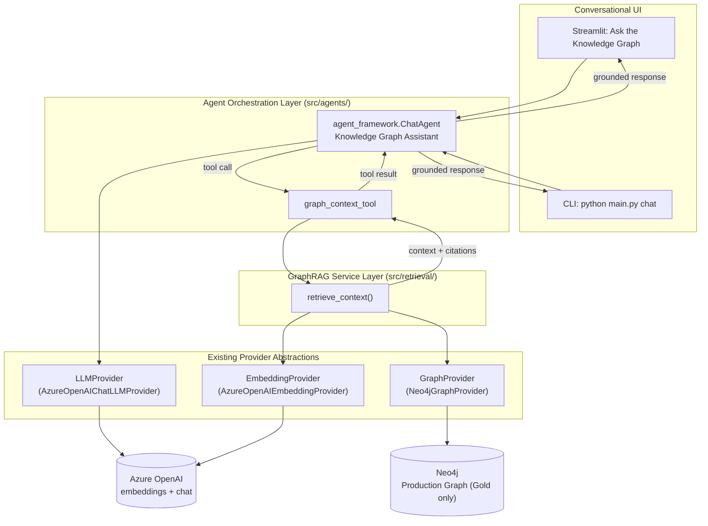
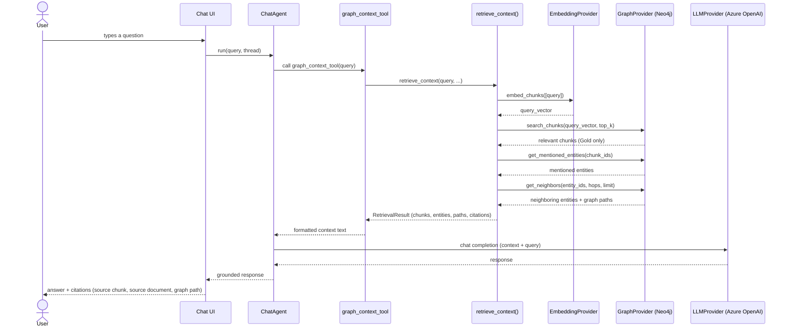

# GraphRAG Retrieval + Conversational AI Layer

## Summary

The pipeline previously stopped at "approved graph published to Neo4j" -
there was no way to ask it a question. This extends the existing six-provider
architecture (`DocumentSource`, `StorageProvider`, `ApprovalProvider`,
`OntologyProvider`, `GraphProvider`, `EmbeddingProvider`, plus
`SecretsProvider`/`AuthProvider`) with a Retrieval Layer and a Conversational
AI Layer. Nothing about extraction, chunking, entity/relationship extraction,
approval, ontology generation, or Neo4j publishing changed - this is purely
additive:

```
Docling extraction -> Chunking -> Embeddings -> Entity/Relationship
extraction -> Approval -> Ontology -> Production Graph -> Neo4j
                                                              |
                                                              v
                              GraphRAG Retrieval Layer (new) -> Conversational
                              Agent (new, Microsoft Agent Framework) ->
                              "Ask the Knowledge Graph" (Streamlit, new)
```

## New abstractions (same factory convention as every existing provider)

| Capability | ABC | Implementation | Factory |
|---|---|---|---|
| Real embeddings | `EmbeddingProvider` (existing) | `AzureOpenAIEmbeddingProvider` (new) | `get_embedding_provider()`, `embedding.provider: azure_openai` |
| Chat completion | `LLMProvider` (new) | `AzureOpenAIChatLLMProvider` (new) | `get_llm_provider()`, `llm.provider: azure_openai` |
| Graph reads for retrieval | `GraphProvider` (existing, +3 methods) | `Neo4jGraphProvider` (existing, extended) | `get_graph_provider()` (unchanged) |

`LLMProvider.get_chat_client()` returns a Microsoft Agent Framework
`ChatClientProtocol` implementation (`agent_framework.azure.AzureOpenAIChatClient`),
not raw text - the agent layer owns the completion loop, not the provider.

Secrets (`AZURE_OPENAI_ENDPOINT`, `AZURE_OPENAI_API_KEY`) are resolved via the
existing `SecretsProvider` abstraction, the same indirection
`Neo4jGraphProvider` already uses - never hardcoded in `config.yaml`.

## Architecture diagram



## Sequence diagram (one turn)



## Retrieval pipeline (`src/retrieval/graphrag_service.py`)

`retrieve_context(query, embedding_provider, graph_provider, config)`:

1. Embed the query via `EmbeddingProvider.embed_chunks()` (reusing the exact
   same abstraction/model the ingest pipeline uses for chunks).
2. `GraphProvider.search_chunks()` - Neo4j native vector index lookup
   (`CALL db.index.vector.queryNodes('chunk_embedding', ...)`).
3. `GraphProvider.get_mentioned_entities()` - walks the existing
   `(Chunk)-[:MENTIONS]->(Entity)` relationship (already present, no schema
   change - see `Neo4jLoader.load_mentions()`).
4. `GraphProvider.get_neighbors()` - graph expansion to neighboring entities
   within `retrieval.graph_expansion_hops` hops, capped at
   `retrieval.max_neighbors`.
5. Assembles a `RetrievalResult` (chunks, entities, human-readable graph
   paths, citations) and renders it as plain text for the LLM
   (`format_context_for_llm()` - never emits "node"/"edge"/"cypher").

## Gating invariant (extends the Silver/Gold separation)

**Only the Gold Production Graph is ever used to answer a question. The
Candidate Graph is never queried by anything in `src/retrieval/` or
`src/agents/`.** This is structural, not a runtime check:

- `GraphProvider.publish()` is the only code path that ever writes to Neo4j,
  fed exclusively by `ontology_provider.load_for_graph()` (approved-only) -
  documented in `docs/architecture/graph_governance.md`.
- The three new read methods (`search_chunks`, `get_mentioned_entities`,
  `get_neighbors`) live on the same `GraphProvider`/`Neo4jGraphProvider`
  that only ever receives approved data. There is nothing in
  `src/retrieval/graphrag_service.py` that references `ApprovalProvider`'s
  candidate-side methods or `StorageProvider.read_candidate_graph()` at all.
- If Neo4j has never been published to (empty Production Graph), retrieval
  simply returns no chunks, and the agent is instructed to say it lacks
  enough approved information rather than guess.

## Chunk embeddings on the graph (Requirement: reuse embeddings, vector index)

`EmbeddingStage` (unchanged) writes `DocumentEmbeddingRecord`s to
`silver/embeddings/embeddings.json`, keyed by `chunk_id` - separate from
`silver/chunks/chunks.json`. `GraphStage` now joins the two by `chunk_id`
before calling `graph_builder.build_graph()`, so `Chunk` nodes carry an
`embedding` property. `Neo4jLoader.load_graph()` creates the vector index
(`CREATE VECTOR INDEX chunk_embedding IF NOT EXISTS ... cosine similarity`)
once real embeddings are present - idempotent, safe to call on every
`publish-graph` run, and a no-op when running with `embedding.provider:
local_noop` (chunks simply have no `embedding` property, same as before).

## UI language

Consistent with `app/common.py`'s binding rule: "Ask the Knowledge Graph"
never uses "Node", "Edge", "Cypher", or "Ontology Class". Citations render
as a source-chunk/source-document table plus graph paths phrased as
entity-relationship sentences (e.g. "Billing Service USES Payment Gateway"),
matching the existing Production Graph page's table-based style - no new
graph-visualization dependency.

## Implementation plan (as executed)

1. `AzureOpenAIEmbeddingProvider` (`src/providers/azure_openai_embedding_provider.py`)
   + `azure_openai` branch in `get_embedding_provider()`.
2. `LLMProvider` ABC (`src/providers/llm_provider.py`) +
   `AzureOpenAIChatLLMProvider` + `get_llm_provider()` factory.
3. `GraphProvider` ABC gains `search_chunks`/`get_mentioned_entities`/
   `get_neighbors`; implemented in `Neo4jGraphProvider`; stubbed with
   `NotImplementedError` in `CosmosGraphProvider` to stay instantiable.
4. `Neo4jLoader` gains `create_vector_index`, an `embedding` passthrough in
   `load_chunks`, and the three query methods.
5. `GraphStage` joins `storage.read_embeddings()` onto chunks by `chunk_id`
   before `graph_builder.build_graph()`; `build_graph()` gains an additive
   `embedding` field on chunk nodes.
6. `src/retrieval/graphrag_service.py` - `retrieve_context()` +
   `RetrievalResult` + `format_context_for_llm()`.
7. `src/agents/graphrag_agent.py` - `GraphRAGAgent` wrapping an
   `agent_framework.ChatAgent` with a single `graph_context_tool`.
8. `LLMConfig`/`RetrievalConfig` added to `AppConfig`; `llm:`/`retrieval:`
   sections added to `config.yaml`.
9. `chat` subcommand added to `src/main.py` (terminal REPL).
10. `app/pages/chat.py` (Streamlit conversational UI with citations),
    registered in `app/streamlit_app.py`.
11. This document.
12. `README.md` updated with the extended flow, new page, new CLI command,
    and new `.env` variables.
13. `requirements.txt` gains `agent-framework`, `agent-framework-azure-ai`.
14. `tests/test_graphrag_service.py` + provider-factory tests.
15. Full test suite re-run to confirm no regressions.

## Verification

1. `pytest tests/` - existing suite stays green, plus new retrieval tests.
2. With real `AZURE_OPENAI_*` secrets and Neo4j running: `ingest` (real
   embeddings), `publish-graph` (vector index + chunk vectors loaded), then
   `python src/main.py chat` - ask a question, confirm a grounded answer
   with citations naming real chunk/document ids.
3. `streamlit run app/streamlit_app.py` -> "Ask the Knowledge Graph" - same
   question, confirm citations render as a table and no
   "Node"/"Edge"/"Cypher"/"Ontology Class" text appears anywhere on the page.
4. Ask a question with no relevant approved content - confirm the agent says
   it lacks enough approved information, and confirm only `GraphProvider`
   methods were ever called (no `ApprovalProvider`/`StorageProvider`
   candidate-side reads) in `src/retrieval/`.
